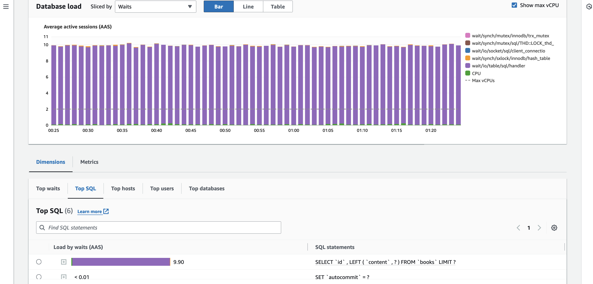
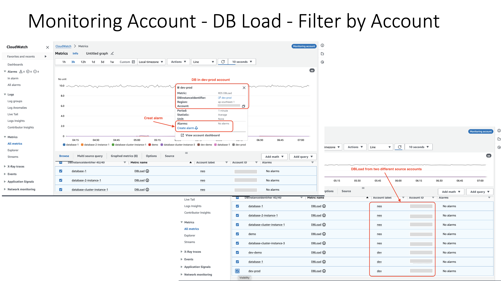
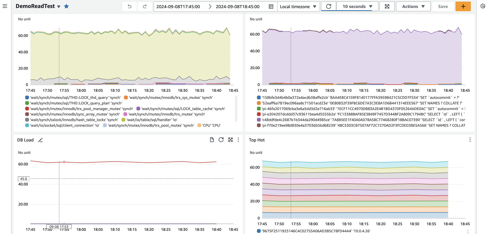
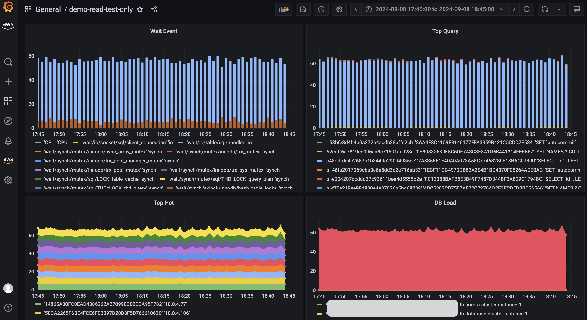

## CloudWatch Cross Account Observability

[oam-2](./assets/oam-2.png)

## Extend Beyond AWS with Grafana

[oam-3](./assets/oam-3.png)

## RDS Performance Insights

Load test RDS MySQL instance using Amazon ECS tasks.

## CloudWatch Dashboard

Explore metric from the centralized CloudWatch monitoring account.

Build dashboard from the centralized CloudWatch monitoring account.

## Grafana Dashboard

Build dashboard from centralized Grafana monitoring account.

